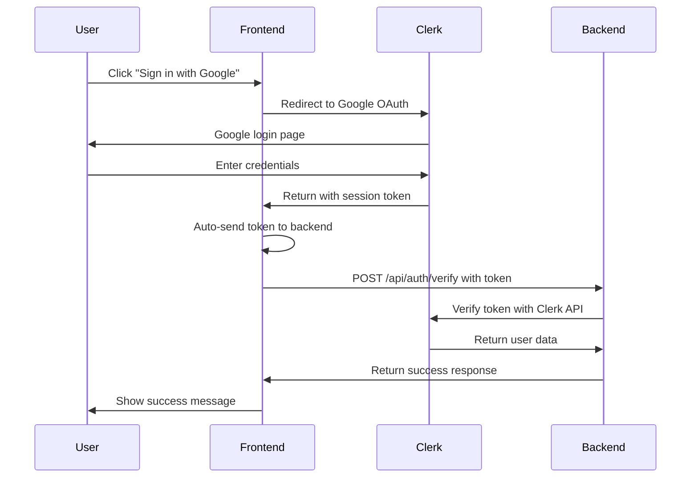

# Token Authentication Setup Guide

This guide explains how to send Clerk authentication tokens to your backend after Google login.

## 🚀 How It Works

1. **User signs in** with Google via Clerk
2. **Token is automatically captured** from Clerk session
3. **Token is sent to your backend** via API route
4. **Backend verifies token** with Clerk and processes user data

## 📁 Files Created

### Frontend Files
- `src/lib/auth.ts` - Utility functions for token handling
- `src/app/api/auth/verify/route.ts` - API route to send tokens to backend
- `src/app/login/page.tsx` - Updated login page with token handling

### Backend Example
- `backend-example.js` - Example Express.js backend handler

## 🔧 Setup Instructions

### 1. Environment Variables

Add these to your `.env.local` file:

```bash
# Clerk Environment Variables
NEXT_PUBLIC_CLERK_PUBLISHABLE_KEY=your_actual_publishable_key
CLERK_SECRET_KEY=your_actual_secret_key

# Backend Configuration
BACKEND_URL=http://localhost:8000/api/auth/verify
```

### 2. Backend Configuration

Update the `BACKEND_URL` in your API route (`src/app/api/auth/verify/route.ts`) to point to your actual backend:

```typescript
const backendUrl = process.env.BACKEND_URL || "http://localhost:8000/api/auth/verify";
```

### 3. Backend Implementation

Use the example in `backend-example.js` to implement your backend handler. Key points:

- **Verify token** with Clerk's API
- **Extract user data** from the token
- **Store user session** in your database
- **Return success response** to frontend

## 🔄 Token Flow



## 📊 Token Data Structure

The token sent to your backend includes:

```json
{
  "token": "clerk_session_token_here",
  "userData": {
    "id": "user_123",
    "email": "user@example.com",
    "firstName": "John",
    "lastName": "Doe",
    "imageUrl": "https://img.clerk.com/..."
  },
  "timestamp": "2024-01-01T00:00:00.000Z"
}
```

## 🛠️ Usage Examples

### Frontend - Get Token in Component

```typescript
import { useUser } from "@clerk/nextjs";

function MyComponent() {
  const { user } = useUser();
  
  const sendTokenToBackend = async () => {
    const token = await user?.getToken();
    // Send token to your backend
  };
}
```

### Backend - Verify Token

```javascript
// Express.js example
app.post('/api/auth/verify', async (req, res) => {
  const { token } = req.body;
  
  // Verify with Clerk
  const response = await fetch('https://api.clerk.com/v1/sessions/verify', {
    method: 'POST',
    headers: {
      'Authorization': `Bearer ${process.env.CLERK_SECRET_KEY}`,
      'Content-Type': 'application/json',
    },
    body: JSON.stringify({ token }),
  });
  
  if (response.ok) {
    // Token is valid, process user data
    res.json({ success: true });
  }
});
```

## 🔒 Security Notes

1. **Never expose** `CLERK_SECRET_KEY` on the frontend
2. **Always verify** tokens on your backend
3. **Use HTTPS** in production
4. **Validate** all incoming data
5. **Store tokens securely** if needed

## 🐛 Troubleshooting

### Common Issues

1. **"No authentication token found"**
   - User not signed in
   - Check Clerk configuration

2. **"Backend authentication failed"**
   - Backend URL incorrect
   - Backend not running
   - Token verification failed

3. **CORS errors**
   - Configure CORS on your backend
   - Check allowed origins

### Debug Steps

1. Check browser console for errors
2. Verify environment variables
3. Test backend endpoint directly
4. Check Clerk dashboard for token validity

## 📝 Next Steps

1. **Set up your backend** using the example
2. **Configure environment variables**
3. **Test the authentication flow**
4. **Customize user data handling**
5. **Add error handling** for your use case

## 🔗 Useful Links

- [Clerk Documentation](https://clerk.com/docs)
- [Clerk Backend SDK](https://clerk.com/docs/backend-requests/handling/manual-jwts)
- [Next.js API Routes](https://nextjs.org/docs/app/building-your-application/routing/route-handlers)
